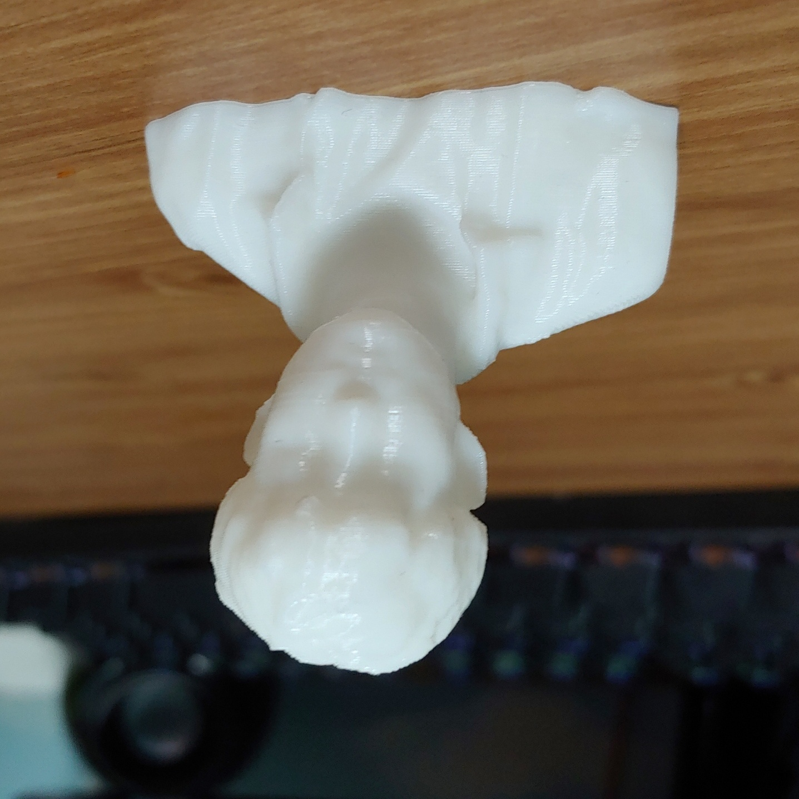
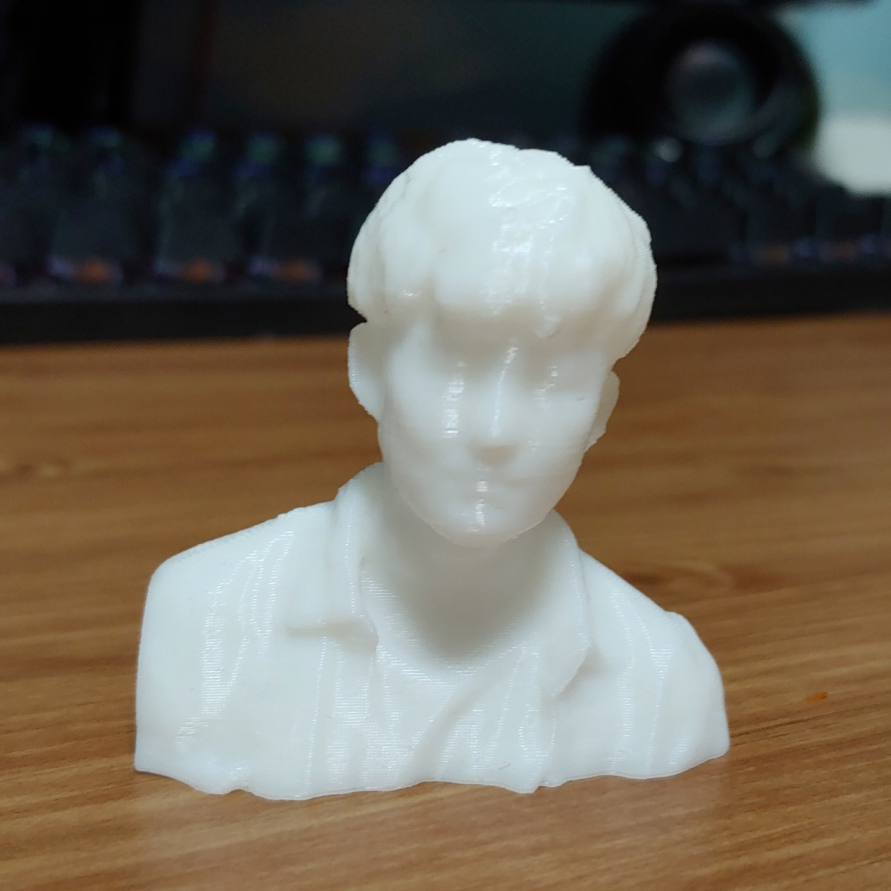
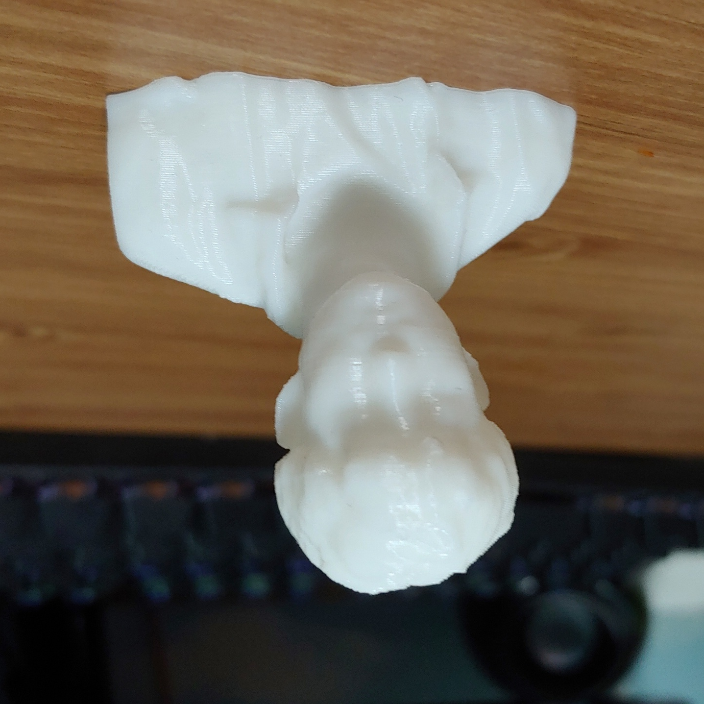

# Img DATA (CV)

### Original DATA 

  

## Flipping

vertical

 

horizontal

 

vertical & horizontal

 

## Gray scale

 

## Brightness

 

## Rotation

 

## Center Crop

 

## Saturation

 

 
 

## Code
[Python](./ImgDATA_openCV.ipynb)  
C++ 

 
 
 
 

 
 

#### Getting ready

Gaussian noise, Contrast change, Sharpen, Affine transformation, Padding, Blurring

