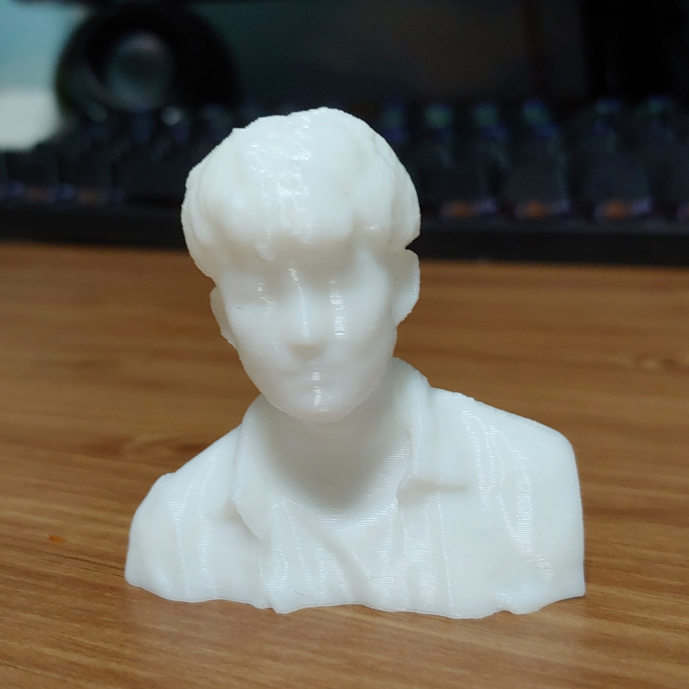

# Img DATA (CV)

 [code](./ImgDATA_openCV.ipynb)

### Original DATA 

  

## Flipping

## Gray scale

## Brightness

## Rotation

## Center Crop

## Saturation

 
 
 
 

Gaussian noise, Contrast change, Sharpen, Affine transformation, Padding, Blurring